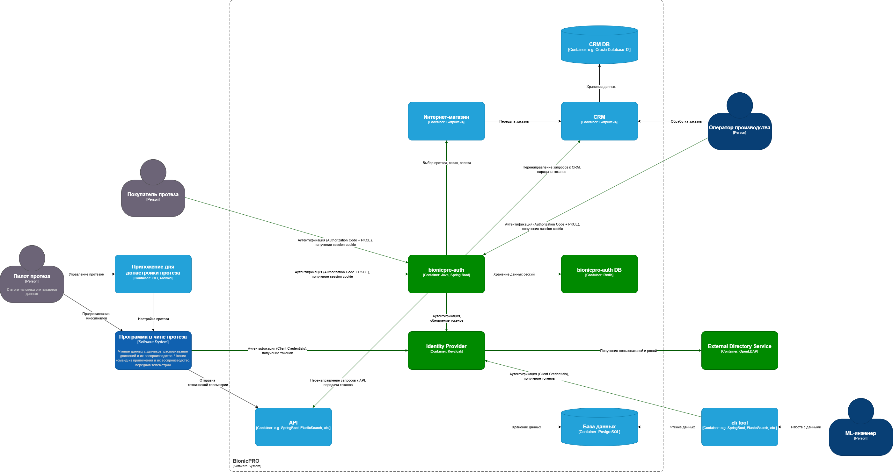
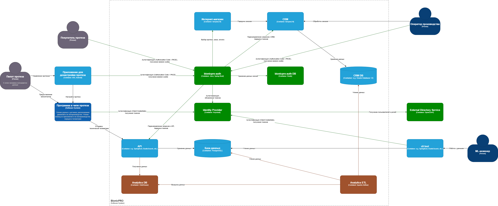

# Проектная работа

## Задание 1

**Диаграмма архитектуры системы:**

**Результаты:**

* [Код BFF](bionicpro-auth)
* [Измененный фронтенд](frontend/src/components/ReportPage.tsx)
* [Экспортированный Keycloak realm](keycloak/keycloak-results-export.json)

## Задание 2

**Диаграмма архитектуры системы:**

**Результаты:**

* [Инициализация схем БД и тестовых данных](airflow)
* [DAG](dags/bionicpro_telemetry.py)
* [Код сервиса API](bionicpro-api)

## Задание 3

**Код для работы с S3 и CDN в сервисе API:**

* [S3Service.java](bionicpro-api/src/main/java/ru/bionicpro/api/S3Service.java)
* [S3Configuration.java](bionicpro-api/src/main/java/ru/bionicpro/api/S3Configuration.java)
* [CdnService.java](bionicpro-api/src/main/java/ru/bionicpro/api/CdnService.java)
* [ReportHandler.java](bionicpro-api/src/main/java/ru/bionicpro/api/ReportHandler.java)

**Конфигурация nginx:**

[nginx.conf](cdn/nginx.conf)

## Задание 4

**Результаты:**

* [Конфигурация Debezium connector](debezium/register-crm-connector.json)
* [Создание пользователя и выдача прав для Debezium](airflow/init-crm-db.sql)
* [Настройка чтения данных из Kafka и сохранение в ClickHouse](airflow/init-clickhouse-db.sql)
